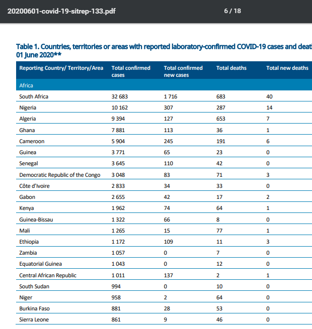
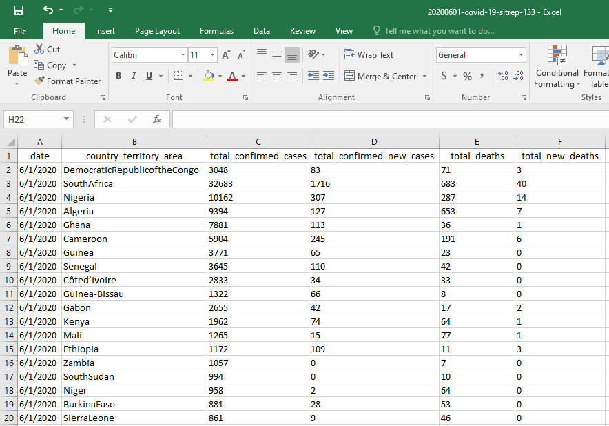
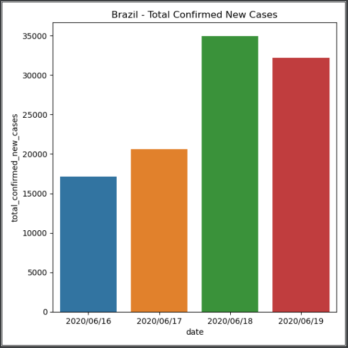
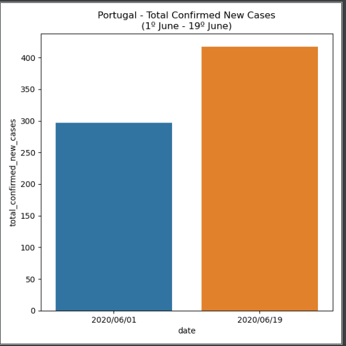
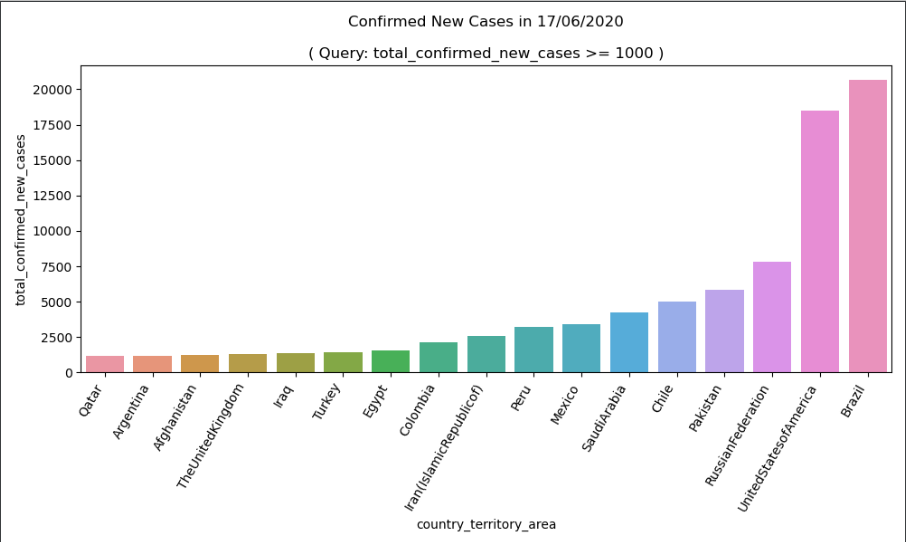
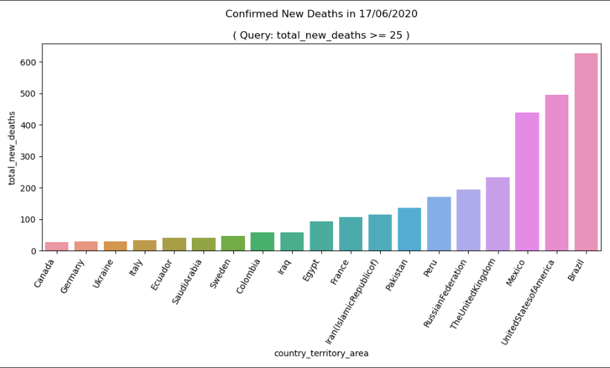

## World Health Organization - PDF Data Mining
Python algorithm for converting WHO official COVID daily reporting tables (PDF) into simple data format (Pandas / CSV file).

### Project Overview

This code is an adaptation of Lain's tutorial code, posted at:
http://www.degeneratestate.org/posts/2016/Jun/15/extracting-tabular-data-from-pdfs/

The main adaptation is this code suitable for reading the tables of daily reports of the World Health Organization (WHO) on COVID.

## Features
- Converts Official COVID PDF tables to CSV.
- Query Algorithms for data visualization.

## Core Libraries
- PDF Mining: https://github.com/pdfminer/pdfminer.six
- Data Manipulation: https://github.com/pandas-dev/pandas
- Data Visualization: https://github.com/mwaskom/seaborn 

## How it works?
* Place a PDF* inside input folder.
* Run "WHO_PDF_MINER.py" and set <codE>pdf_file_name</code> variable as the name of your PDF.
* The Output CSV will be created in the output folder with the same name as the PDF.

*You can download official WHO pdfs from this link: https://www.who.int/emergencies/diseases/novel-coronavirus-2019/situation-reports/

## PDF Miner Algorithm:

#### Input PDF (PdfMiner)

#### Output CSV (Pandas)

## Query Algorithms (Pandas / Seaborn):

#### One Country Plot -> By Given Dates & Column/Attribute
  

#### One Date Plot -> By Given Column/Attribute

